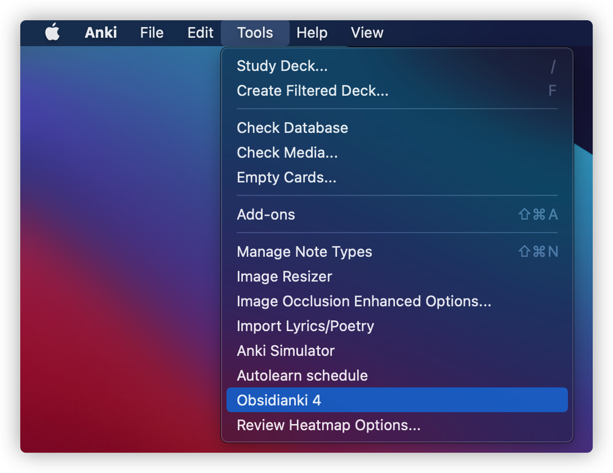

# obsidianki 4

**Please back-up your vault regularly while using this add-on!**

This is a [Anki](https://github.com/ankitects) add-on that would import your files from [Obsidian](https://obsidian.md) into Anki while preserving the wiki-links. Each file in Obsidianki will be converted to a single note in Anki. It does so by searching through your vault for the file with the name specified and generating an Obsidian url from the path. 

Its github page is [obsidianki4](https://github.com/wxxedu/obsidianki4). 

## How to Install

You can install this Add-on by downloading the `obsidianki 4.ankiaddon` file from the releases section of GitHub and double click on it. 

You can also download from AnkiWeb: [Obsidianki 4 Addon Page](https://ankiweb.net/shared/info/620260832). The code for this add-on is 620260832.

## How to Use

Before starting to use, you will have to install Obsidianki's template, without which Obsidianki would not work. To do so, go to Anki's Add-ons folder, open the folder "Obsidianki 4", and find `Obsidianki 4.apkg`. Double click on it to install. You can also download it from GitHub. 

After you've installed the Add-on, you can open Anki, select `Tools` -> `Obsidianki 4`, as shown in the following picture.



The following menu will pop-up, which will include the default preferences panel. **NOTE THAT THE SETTINGS IN THIS PANEL ARE ALL DEFAULT SETTINGS**, and you **SHOULD NOT** change them regularly, as a change will **AFFECT ALL YOUR NOTES**.


Copy the path of your Obsidian vault into the first field. Note that you will have to use **forward slashes** `/` instead of backward ones for Obsidianki to function properly. 

After you've set the settings (I will explain in the next section), you can click on "Save and Convert", and it will complete the conversion. However, you won't notice a difference. Why? Because Anki's interface is not refreshed. To refresh the interface, you could click on anything in Anki's main interface, and it should be refreshed. 

## Default Settings

Now, let's take a look at the default settings. 

### Vault Path

This place shows the path to your vault. Note that in order for the wiki-links in Anki to link back to Obsidian, you will have to use a path that is actually a vault. If you just copy the path of a folder in the vault, the link function will not work. 

Another thing to take especial note of is that you should use **forward slashes** instead of backward ones. 

### Mode

There are four importing cloze modes in Obsidianki. 

#### `word` mode

It generates a card for every cloze. If you have 10 clozes, it generates 10 cards from `{{c1::Card 1}}` to `{{c10::}}`.

#### `line` mode

It generates a card for every line. If you have 10 clozes in the first line, they will be `{{c1::Card 1}}` to `{{c10::Card 10}}`. If you have 2 more clozes in the second line, they will be `{{c2::Card 11}}` to `{{c2::Card 12}}`.

#### `heading` mode (Recommended)

It generates a card for the content under every heading, with the exception of list cards and QA cards (I will explain this below). If you have a file as below:

```markdown
# Heading 1

Hello **Obsidianki**.

This is the best **Anki** add-on for importing Obsidian files into **Anki**.

## Heading 2

This is something **interesting**.

Q: What is the best add-on for importing Obsidian files into **Anki**?

A: Obsidianki!

What are the features of Obsidianki?

1. Import files
2. Preserve wiki links
3. Convert to Clozes

## Heading 3

This is **Heading 3**.

```

The "Obsidianki", "Anki" under "Heading 1" will be turned into `{{c1::Obsidianki}}` and `{{c1::Anki}}` respectively.

Theoretically, everything under "Heading 2" should be turned into `{{c2::...}}` cards, right? Not quite, because I have added QA cards and list cards. So, after conversion, the portion under heading to would become:

```markdown
## Heading 2

This is something **{{c2::interesting}}**.

Q: What is the best add-on for importing Obsidian files into **Anki**?

A: {{c3::Obsidianki!}}

What are the features of Obsidianki?

1. {{c4::Import files}}
2. {{c5::Preserve wiki links}}
3. {{c6::Convert to Clozes}}
```

#### `document` mode

In the document mode, everything will be converted to `{{c1::...}}`.

### Type

There are two types in Obsidianki 4: `cloze` and `basic`. Nevertheless, these two types are different from Anki's `cloze` and `basic`. 


